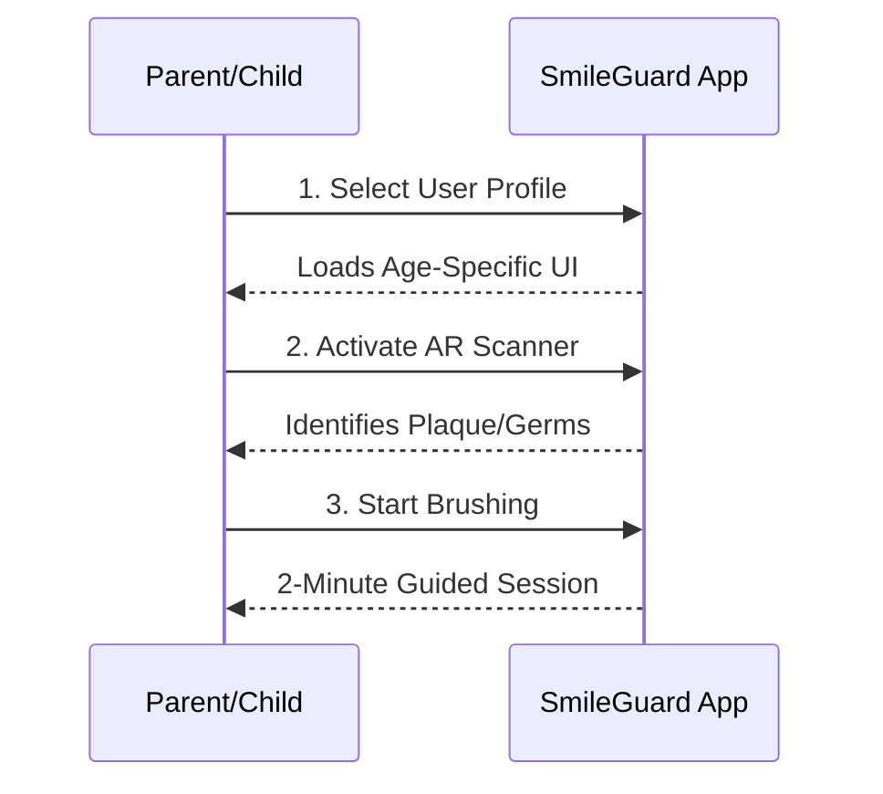

# SmileGuard App

Welcome to SmileGuard - an innovative dental hygiene application designed to make brushing teeth fun and effective for users of all ages!

## 🦷 Overview

SmileGuard is an interactive dental hygiene app that uses AR technology to guide users through proper brushing techniques. The app adapts its interface based on the user's age profile to provide an optimal experience for both children and adults.

## 📋 Sequence Diagram

The following sequence diagram illustrates the core user flow of the SmileGuard application:

## 🚀 Features

- **Age-Specific UI**: The app loads an interface tailored to the user's age group for optimal engagement
- **AR Scanner**: Advanced augmented reality technology identifies plaque and germs in real-time
- **Guided Brushing Sessions**: 2-minute interactive brushing sessions to ensure proper dental hygiene
- **Professional Design**: Clean, intuitive interface with high readability

## 💡 How It Works

1. **Select User Profile**: Choose the appropriate user profile for age-specific experience
2. **Activate AR Scanner**: Use the camera to scan teeth and identify problem areas
3. **Start Brushing**: Begin the guided 2-minute brushing session
4. **Follow Guidance**: The app provides real-time feedback during brushing

## 🎨 UI Design Philosophy

This application follows a professional, clean design approach with high readability as preferred for SaaS products. The interface is designed to be both engaging for children and professional for adult users.

## 📱 Technologies Used

- HTML5
- CSS3
- JavaScript
- AR Technology
- Responsive Design Framework

## 🤝 Contributing

We welcome contributions to enhance the SmileGuard experience! Feel free to fork this repository and submit pull requests with your improvements.

## 📄 License

This project is licensed under the MIT License - see the LICENSE file for details.